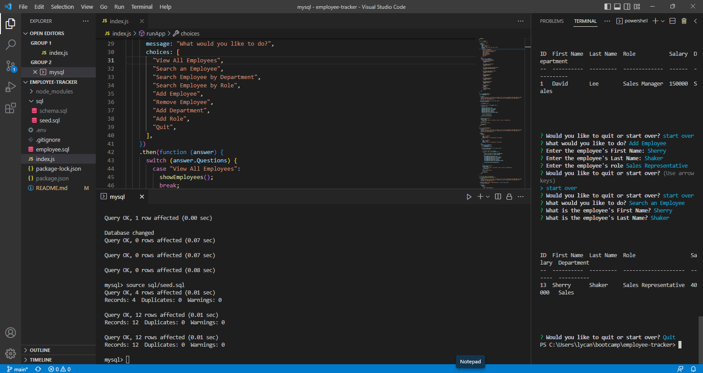
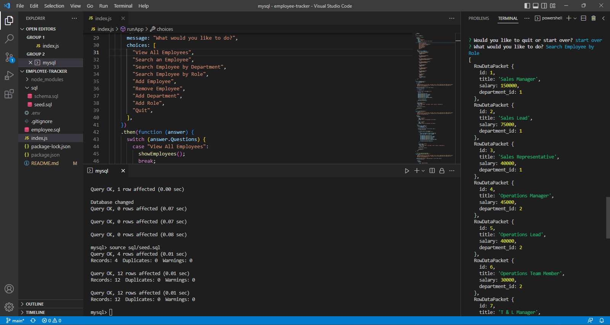
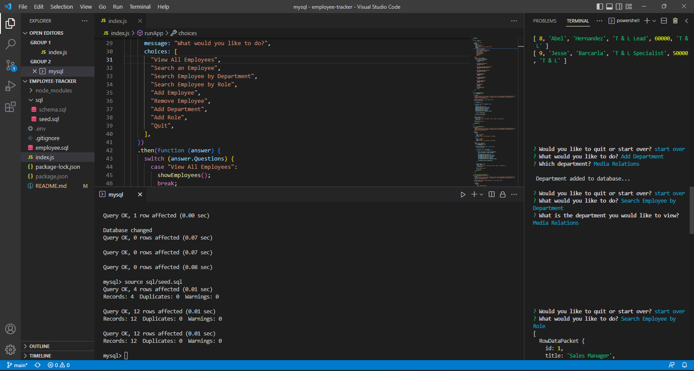

# EMPLOYEE TRACKER
**Employee Tracker** is an Employee Tracker application built using JS, MySQL, Json, inquirer, prettier, express, dotenv and node.js.

## User Story
***
```md
AS A business owner
I WANT to be able to view and manage the departments, roles, and employees in my company
SO THAT I can organize and plan my business
```
<br>

## Acceptance Criteria

```md
GIVEN a command-line application that accepts user input
WHEN I start the application
THEN I am presented with the following options: view all departments, view all roles, view all employees, add a department, add a role, add an employee, and update an employee role
WHEN I choose to view all departments
THEN I am presented with a formatted table showing department names and department ids
WHEN I choose to view all roles
THEN I am presented with the job title, role id, the department that role belongs to, and the salary for that role
WHEN I choose to view all employees
THEN I am presented with a formatted table showing employee data, including employee ids, first names, last names, job titles, departments, salaries, and managers that the employees report to
WHEN I choose to add a department
THEN I am prompted to enter the name of the department and that department is added to the database
WHEN I choose to add a role
THEN I am prompted to enter the name, salary, and department for the role and that role is added to the database
WHEN I choose to add an employee
THEN I am prompted to enter the employee’s first name, last name, role, and manager, and that employee is added to the database
WHEN I choose to update an employee role
THEN I am prompted to select an employee to update and their new role and this information is updated in the database 
```
 <br>

  ## FEATURES
  ***
  
  Features of the deployed application and repository are as follows:
  * The ability to add and remove employees from the "Employee Databse" as well as view thier department, roles and salary. 

 <br>

  ## TECHNOLOGY USED
  ***
    JS 
    MySQL
    inquirer
    Json 
    express 
    node.js
    prettier
 
<br>

## THE VIDEO WALKTHROUGH CAN BE FOUND HERE:
***

<br>

<a href="https://drive.google.com/file/d/1cRloSuHnuy-TH4UygXTBstVVjWaeUzaS/view">Click here to watch the walkthrough video!</a>

<br>

## Images of the completed application:
***
<br>

## Screen shot of adding an Employee



<br>

## Screen shot of Searching by Role



<br>

## Screen shot of adding an Department


<br>


  ## INSTALLATION OF THE REPO FROM GITHUB
  ***
  A copy of the repository can be cloned at [${response.GitHub}]. 
    * Simply click on the repo and select **Clone**. 
    * From the drop down menu select the copy icon. Type (directly into your terminal):
    ```
    'git clone' + 'the repo link' + enter.
     
<br>

  ## License
 - - -
© 2022 Trilogy Education Services, LLC, a 2U, Inc. brand. Confidential and Proprietary. All Rights Reserved.
